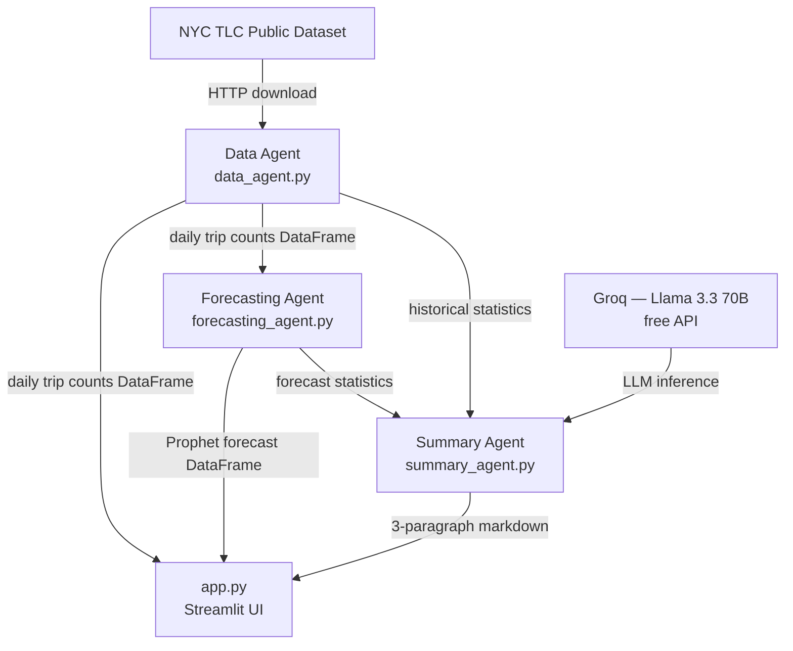

# NYC Taxi Demand Forecast

A multi-agent forecasting demo built with Streamlit. Fetches NYC yellow taxi trip data, generates a probabilistic forecast using Prophet, and produces an executive summary via Groq.

## Live Demo

[forecasting-demo-edmrrbnggmqxk3pnsgsfw5.streamlit.app](https://forecasting-demo-edmrrbnggmqxk3pnsgsfw5.streamlit.app)

## Why This Matters

Demand forecasting is one of the highest-leverage capabilities an organization can have. Every industry that moves people, goods, or resources operates more efficiently when it can see what's coming — and most of them are still doing it with spreadsheets, gut feel, or expensive proprietary tools.

This project demonstrates that a production-grade forecasting pipeline with probabilistic uncertainty bounds and natural-language interpretation can be assembled from entirely open-source and free-tier components. That has real consequences for who can use forecasting and at what cost.

**Industries where this stack applies directly:**

- **Logistics and delivery** — forecast parcel volumes by route or depot to pre-position drivers and vehicles before demand spikes, not after.
- **Retail and e-commerce** — predict daily or weekly order volumes to optimize staffing at fulfillment centers and reduce both overstock and stockouts.
- **Healthcare** — anticipate emergency department visit load, appointment demand, or medication usage to staff appropriately and avoid critical shortages.
- **Energy and utilities** — model electricity or water demand curves by zone, enabling smarter load balancing and infrastructure investment decisions.
- **Public transit** — extend this exact taxi model to buses, trains, or bikeshare — any ridership dataset with timestamps produces actionable capacity forecasts.
- **Hospitality and events** — project occupancy, reservation volume, or food-and-beverage demand to reduce waste and improve guest experience.
- **SaaS and infrastructure** — forecast API call volume or compute usage to right-size capacity and avoid both over-provisioning and service degradation.
- **Finance** — apply the same probabilistic framework to transaction volumes, support ticket inflows, or any operational metric that drives cost.

**What makes this architecture worth replicating:**

The modular agent design means any component can be swapped independently. Replace Prophet with a Temporal Fusion Transformer for a dataset where deep learning outperforms classical methods — the summary agent needs no changes. Point the data agent at a different source entirely — the forecasting and summarization layers are unaffected. That decoupling is the real value, not any single library choice.

The executive summary layer turns a statistical artifact into a decision-support tool. A forecast DataFrame is useful to a data scientist; a three-paragraph plain-English interpretation of that same forecast is useful to a VP of Operations making a staffing call at 8am. Bridging that gap is what makes AI-assisted forecasting actually get used.

## Architecture

Three independent agents orchestrated by `app.py`:

| Agent | File | Role |
|-------|------|------|
| Data | `agents/data_agent.py` | Downloads NYC TLC parquet, aggregates to daily trip counts |
| Forecasting | `agents/forecasting_agent.py` | Fits Prophet model, returns probabilistic forecast |
| Summary | `agents/summary_agent.py` | Calls Groq (Llama 3.3 70B) to generate an executive summary |



## A Note on "Multi-Agent"

This app uses three specialized modules in a fixed pipeline — data, forecasting, and summarization — each with a single responsibility. That's a clean separation of concerns, but it isn't truly multi-agent. Each module runs on a predetermined schedule with no ability to influence what happens next.

A genuine multi-agent system would introduce three properties this demo lacks:

- **Autonomy** — agents decide whether and when to act. For example, the forecasting agent could assess data quality and refuse to run if fewer than 14 days of clean data are available, rather than always producing a forecast regardless of input.
- **Decision-making** — agents choose between paths at runtime. Claude could act as an orchestrator, inspecting the forecast uncertainty and deciding whether to widen the date range, switch forecasting models, or flag the result as unreliable before passing it to the summary step.
- **Inter-agent communication** — agents exchange structured messages rather than receiving fixed inputs from a central controller. The summary agent could send a follow-up request back to the forecasting agent asking for a breakdown by day-of-week, and the forecaster would respond dynamically rather than returning a predetermined DataFrame.

In practice, this would be implemented using an agent framework (such as the Anthropic Agents SDK) with a message bus or shared memory layer replacing the direct function calls in `app.py`.

## Stack

- [Streamlit](https://streamlit.io) — UI and deployment
- [Prophet](https://facebook.github.io/prophet/) — time series forecasting
- [Plotly](https://plotly.com) — interactive chart
- [Groq](https://groq.com) — natural-language executive summary via Llama 3.3 70B (free tier)
- [NYC TLC Trip Record Data](https://www.nyc.gov/site/tlc/about/tlc-trip-record-data.page) — public dataset

## Local Setup

**Requirements:** Python 3.12

```bash
python3.12 -m venv .venv
source .venv/bin/activate
pip install -r requirements.txt
```

Create `.streamlit/secrets.toml` (see `secrets.toml.example`):

```toml
GROQ_API_KEY = "gsk_..."
```

Get a free API key from the Groq console at https://console.groq.com.

```bash
streamlit run app.py
```
