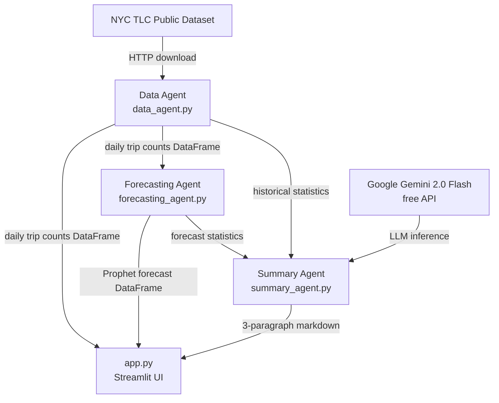

# NYC Taxi Demand Forecast

A multi-agent forecasting demo built with Streamlit. Fetches NYC yellow taxi trip data, generates a probabilistic forecast using Prophet, and produces an executive summary via Gemini.

## Live Demo

[forecasting-demo-edmrrbnggmqxk3pnsgsfw5.streamlit.app](https://forecasting-demo-edmrrbnggmqxk3pnsgsfw5.streamlit.app)

## Architecture

Three independent agents orchestrated by `app.py`:

| Agent | File | Role |
|-------|------|------|
| Data | `agents/data_agent.py` | Downloads NYC TLC parquet, aggregates to daily trip counts |
| Forecasting | `agents/forecasting_agent.py` | Fits Prophet model, returns probabilistic forecast |
| Summary | `agents/summary_agent.py` | Calls Gemini 2.0 Flash to generate an executive summary |



## A Note on "Multi-Agent"

This app uses three specialized modules in a fixed pipeline — data, forecasting, and summarization — each with a single responsibility. That's a clean separation of concerns, but it isn't truly multi-agent. Each module runs on a predetermined schedule with no ability to influence what happens next.

A genuine multi-agent system would introduce three properties this demo lacks:

- **Autonomy** — agents decide whether and when to act. For example, the forecasting agent could assess data quality and refuse to run if fewer than 14 days of clean data are available, rather than always producing a forecast regardless of input.
- **Decision-making** — agents choose between paths at runtime. Claude could act as an orchestrator, inspecting the forecast uncertainty and deciding whether to widen the date range, switch forecasting models, or flag the result as unreliable before passing it to the summary step.
- **Inter-agent communication** — agents exchange structured messages rather than receiving fixed inputs from a central controller. The summary agent could send a follow-up request back to the forecasting agent asking for a breakdown by day-of-week, and the forecaster would respond dynamically rather than returning a predetermined DataFrame.

In practice, this would be implemented using an agent framework (such as the Anthropic Agents SDK) with a message bus or shared memory layer replacing the direct function calls in `app.py`.

## Stack

- [Streamlit](https://streamlit.io) — UI and deployment
- [Prophet](https://facebook.github.io/prophet/) — time series forecasting
- [Plotly](https://plotly.com) — interactive chart
- [Google Gemini 2.0 Flash](https://ai.google.dev) — natural-language executive summary (free tier)
- [NYC TLC Trip Record Data](https://www.nyc.gov/site/tlc/about/tlc-trip-record-data.page) — public dataset

## Local Setup

**Requirements:** Python 3.12

```bash
python3.12 -m venv .venv
source .venv/bin/activate
pip install -r requirements.txt
```

Create `.streamlit/secrets.toml` (see `secrets.toml.example`):

```toml
GEMINI_API_KEY = "AIza..."
```

Get a free API key from Google AI Studio at https://aistudio.google.com.

```bash
streamlit run app.py
```
